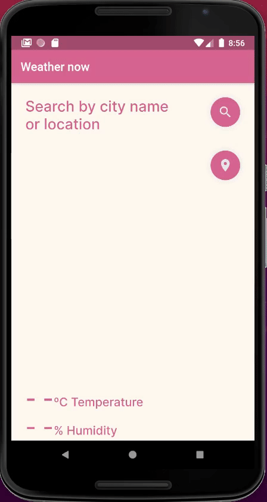

# weather

A new Flutter project.
This app makes http requests to a weather api called Open Weather based on the user's location or the search by the name city.

For the location, the app uses a plugin called geolocator.
For the state management I used mobx.
